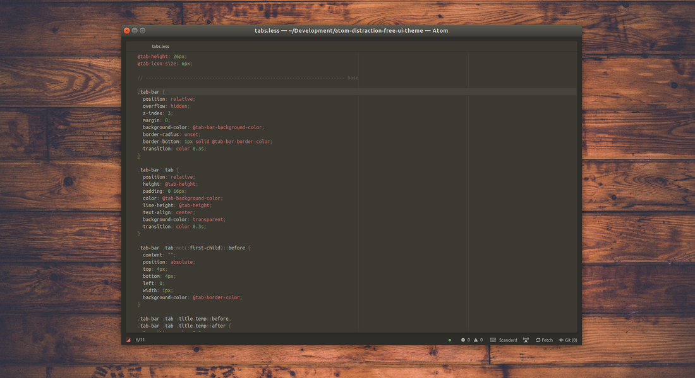
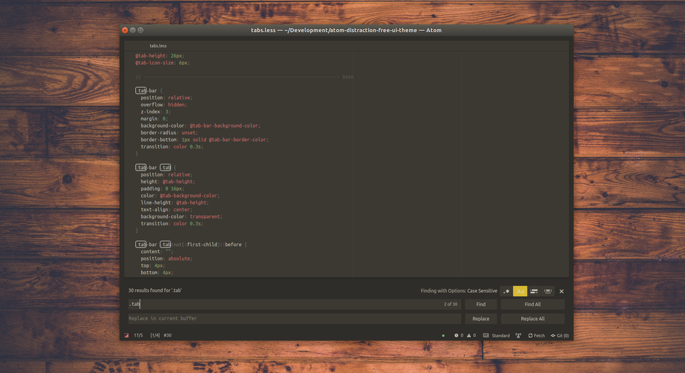

# Distraction free Atom UI Theme

A minimalist UI theme.

Works well with the [distraction free syntax theme](https://atom.io/themes/atom-distraction-free-syntax).

## Goal

This UI theme highlights only the main parts of the editor (the active tab and the text editor), leaving the other elements darker or hidden.

## Details

 - the tree view (well, the entire left panel) is a floating element, better displayed only when necessary via the dedicated key binding
 - the tabs list is faded when not hovered
 - the active tab is the one with a dot displayed under its title
 - many of the borders (panels, tabs, lists) are removed
 - less colors and contrasts

## Recommended custom styles

This custom style configuration do hide some status bar informations.

```css
.status-bar {
  encoding-selector-status,
  grammar-selector-status,
  .file-info,
  .github-branch,
  .github-StatusBarTile,
  .line-ending-tile {
    display: none;
  }
}
```

And this one do hide the scrollbars.

```css
::-webkit-scrollbar {
    display: none;
}
```

## Recommended packages

[Atom auto resize](https://atom.io/packages/atom-auto-resize)

## What it looks like

Default view :



Tree view, with new and modified files :


Search box :



Tabs (active, modified, hovered) :


